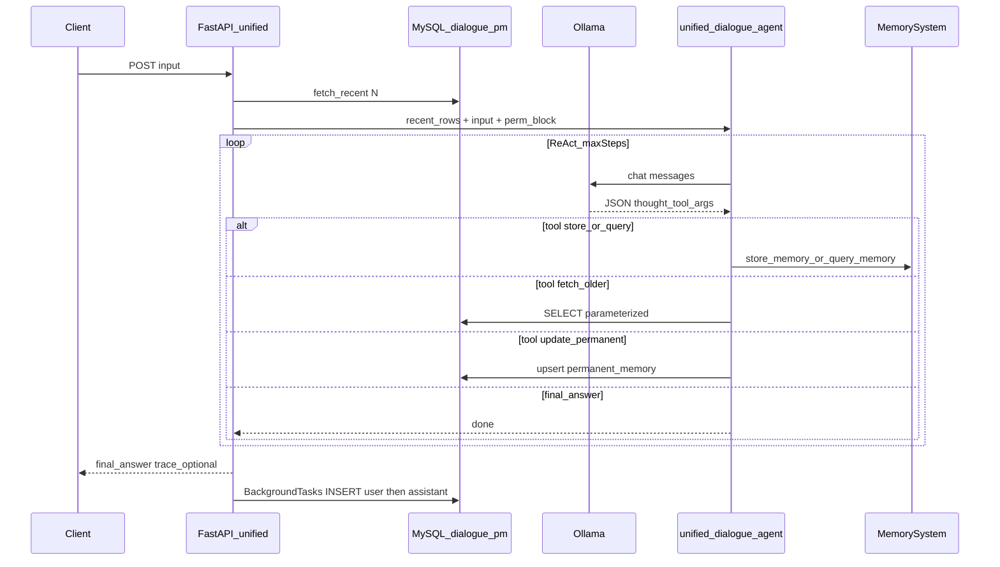

# 统一对话「永不忘」助手详细设计

本文描述 `POST /memory/conversation/unified` 接口背后的产品设计、数据流、ReAct 协议、依赖与运维要点。实现代码主要分布在 [`main.py`](../main.py)、[`unified_dialogue_agent.py`](../unified_dialogue_agent.py)、[`dialogue_store.py`](../dialogue_store.py)、[`permanent_memory_store.py`](../permanent_memory_store.py) 及 [`config.py`](../config.py)。

---

## 1. 背景与目标

### 1.1 问题

传统「单轮 store / 单轮 query」接口能力分散：用户需要**同时**利用（1）近期对话上下文、（2）更早聊天记录、（3）向量+图长期记忆读写、（4）自然语言最终答复时，要在客户端自行编排多次 HTTP 调用，且难以保证「只从本轮写入记忆、不把历史当新事实」等产品规则。

### 1.2 目标（永不忘助手）

对外暴露**单一 HTTP 接口**，服务端在一次请求内完成：

| 能力 | 说明 |
|------|------|
| **会话记忆** | 从 MySQL 对话表读取最近 N 条消息作为短期上下文；响应后异步写回本轮 user + assistant，形成可追溯对话链。 |
| **更早对话** | 在 ReAct 内通过受控工具按游标拉取更早消息，避免模型拼接任意 SQL。 |
| **长期记忆** | 直接调用 `MemorySystem.store_memory` / `query_memory`（Milvus + Neo4j），与现有记忆管线一致。 |
| **永驻记忆** | 可选：三条固定维度（用户身份、智能体性格、工作规范）注入系统提示，并允许模型通过工具更新。 |
| **自然语言答复** | 通过 JSON ReAct 循环，以 `final_answer` 工具结束，同步返回给用户。 |

「永不忘」在此处的含义：**短期**靠 MySQL 对话表滚动窗口 + 按需 `fetch_older_chat`；**长期**靠 Milvus/Neo4j；**人设与规范**靠 MySQL 永驻记忆表（可选）。

---

## 2. 总体架构

- **同步路径**：记忆后端 + 对话 MySQL + Ollama 编排。
- **异步路径**：仅对话表追加两行；失败记日志，不修改 HTTP 状态码（主流程已成功时）。

---

## 3. HTTP 接口契约

### 3.1 路由与方法

- **路径**：`POST /memory/conversation/unified`
- **请求体**（Pydantic `UnifiedConversationRequest`）：

| 字段 | 类型 | 说明 |
|------|------|------|
| `input` | string，必填 | 本轮用户自然语言，最小长度 1。 |
| `include_trace` | bool，默认 `false` | 为 `true` 时在响应中带出 ReAct `trace`（调试用）。 |
| `max_steps` | int，默认见配置，范围 **1～8** | ReAct 最大步数（每步一次模型输出 JSON；含工具步与 `final_answer`）。 |

### 3.2 响应体

| 字段 | 说明 |
|------|------|
| `final_answer` | 字符串。正常为模型通过 `final_answer` 工具给出的 `answer`；若步数用尽仍未结束，则为服务端拼接的说明文案，并可附带**最后一轮**思考/工具/参数或解析失败摘要（便于排障）。 |
| `trace` | 仅当 `include_trace=true` 时存在；列表元素含 `step`、`thought`、`tool`、`arguments`、`observation`（或解析错误时的 `error`/`raw_preview`）。 |

### 3.3 状态码与依赖

| 条件 | HTTP |
|------|------|
| Milvus/Neo4j 等记忆后端未就绪 | **503**（`_memory_or_503`） |
| 对话 MySQL 未就绪 | **503**（`_dialogue_or_503`）；本接口强依赖对话库以提供历史与写回。 |
| Ollama 或编排过程异常 | **502** |
| 永驻记忆不可用 | **不单独失败**：仅不注入永驻块、不提供 `update_permanent_memory` 工具；统一接口仍可 200。 |

用户维度：当前实现固定使用配置项 **`default_user_id`**（与 store/query 一致），请求体中不设 `user_id`。

---

## 4. 启动与运行时依赖

### 4.1 Lifespan 初始化顺序（`main.py`）

1. 连接 `MemorySystem`（Milvus + Neo4j + 嵌入），成功则挂载 `app.state.memory` 与 `SchemaManager`。
2. **对话库**：`DialogueStore.from_settings()` + `ping()`，成功则 `app.state.dialogue_store`；失败记录 `dialogue_startup_error`，统一接口将 503。
3. **永驻记忆库**：`PermanentMemoryStore.from_settings()` + `ping()`，成功则 `app.state.permanent_memory_store`；失败仅打日志，不阻断主服务。

### 4.2 单次请求内线程模型

编排主体 `run_unified_dialogue` 在 **`asyncio.to_thread`** 中执行，避免阻塞事件循环；Ollama 客户端在子线程内同步调用。

---

## 5. 数据层设计

### 5.1 MySQL 对话表（短期会话）

- **模块**：[`dialogue_store.py`](../dialogue_store.py)
- **连接**：`mysql_dialogue_url` 非空则用之，否则回退 `mysql_url`（须具备 **SELECT + INSERT**）。
- **表/列**：由 `config.py` 中 `dialogue_table`、`dialogue_col_*` 配置；表名与列名经正则校验后反引号引用，**禁止**模型参与拼接标识符。
- **读**：
  - `fetch_recent(user_id, limit)`：按 `id` 降序取 `limit` 条，再反转为时间正序，供提示词「最近对话」块使用。**不包含**本轮用户输入（本轮仅出现在 user 消息第二节）。
  - `fetch_older(user_id, before_id, limit)`：`id < before_id`，用于工具 `fetch_older_chat`；`limit` 受 `dialogue_older_fetch_max` 上限约束。
- **写**：
  - `append_exchange`：同一事务内先后 `INSERT` `role=user` 与 `role=assistant` 两行；由 FastAPI **`BackgroundTasks`** 在返回响应后调用，异常吞掉并打日志。

DDL 与索引建议见 [`dialogue_table_ddl.md`](dialogue_table_ddl.md)。

### 5.2 MySQL 永驻记忆表（可选三条）

- **模块**：[`permanent_memory_store.py`](../permanent_memory_store.py)
- **连接**：与对话库相同 URL 策略；账号须 **SELECT + INSERT + UPDATE**。
- **语义**：每用户 `(user_id, category)` 唯一一行；`category` 为 `user_identity` / `agent_personality` / `work_norms`，工具入参使用中文标签映射。
- **内容长度**：单条 `content` 最多 **1000** 字（超长则 `upsert` 返回 `success: false`）。
- **提示注入**：`format_prompt_block(user_id)` 生成 Markdown 风格块，拼在 ReAct 系统提示**最前**；若库不可用则不注入、不提供更新工具。

DDL 与测试用 SQL 见 [`permanent_memory_ddl.md`](permanent_memory_ddl.md)。

### 5.3 长期记忆（Milvus + Neo4j）

- **模块**：[`memory_service.py`](../memory_service.py) 的 `MemorySystem`
- **与统一接口关系**：ReAct 内 `store_memory` / `query_memory` **直接方法调用**，不经过 `/memory/conversation/store` 等 HTTP，避免重复序列化与鉴权分叉。

---

## 6. ReAct 协议与提示词

### 6.1 协议选型

与 [`schema_react_agent.py`](../schema_react_agent.py) 一致：每轮模型仅输出**一个 JSON 对象**（可带代码围栏，解析时剥离），字段固定为：

- `thought`：中文推理摘要  
- `tool`：工具名字符串  
- `arguments`：对象  

解析实现复用 **`_parse_react_json`**（[`schema_react_agent.py`](../schema_react_agent.py)）。

### 6.2 系统提示结构（`unified_dialogue_agent.py`）

拼接顺序（自下而上阅读逻辑顺序）：

1. **永驻记忆块**（若 `perm_store` 可用）：`format_prompt_block` 输出。  
2. **`_UNIFIED_REACT_HEAD`**：角色、四条硬性规则（含「仅从本轮写 store_memory」、必须用 `final_answer` 结束、ReAct 步数说明引用下文）。  
3. **每轮输出格式**：强调仅一个 JSON、无 Markdown 围栏。  
4. **工具列表**：`store_memory`、`query_memory`、`fetch_older_chat`；若永驻可用则多 `update_permanent_memory`，且 `final_answer` 序号顺延为 5。  
5. **动态 `## ReAct 步数限制`**（每步刷新）：写明本轮最多步数、当前第几步、提醒接近上限时尽快 `final_answer`。

### 6.3 首轮 User 消息结构

- 「最近对话」：来自 `fetch_recent` 的格式化文本（含 `id` 供游标）。  
- 「本轮用户输入」：请求体 `input`。  
- 固定说明：`user_id` 与 store/query 维度一致；引导「需要时工具，能答则 `final_answer`」。

### 6.4 后续轮次

- Assistant：上一轮模型输出的 JSON 原文（字符串）。  
- User：以「观察结果」为前缀附上一步 `observation` 的 JSON。  
- 若解析失败：追加纠错 user 消息，要求重新输出合法 JSON；`trace` 记录 `error` 与 `raw_preview`。

### 6.5 对 `final_answer` 的约定（当前实现）

系统提示中对 `final_answer` 的显式要求较少：

- 工具行描述为：**「结束并给用户完整中文回答」**，参数 `{"answer": "..."}`。  
- 硬性规则要求**必须**以该工具结束一轮成功编排。  

**未**在提示中约束：口语化程度、是否禁用【】/emoji、是否禁止暴露内部工具名等；若产品需要，应在 `_UNIFIED_REACT_FINAL_*` 或硬性规则中增补。

---

## 7. 工具语义与实现映射

| 工具名 | 作用 | 服务端实现 |
|--------|------|------------|
| `store_memory` | 写入长期记忆 | `MemorySystem.store_memory(uid, memories, relations)` |
| `query_memory` | 语义检索 | `MemorySystem.query_memory(uid, query_text, …)` |
| `fetch_older_chat` | 更早对话 | `DialogueStore.fetch_older`；单请求内调用次数上限 **8**（`MAX_FETCH_OLDER_CHAT_CALLS`） |
| `update_permanent_memory` | 更新永驻记忆 | `PermanentMemoryStore.upsert`；仅当启动时永驻库可用时出现在工具列表 |
| `final_answer` | 结束 | 读取 `arguments.answer` 为 `final_answer`，写入 `trace` 后 `break` |

未知工具：返回 `observation.error` 列出当前允许的工具名集合。

---

## 8. ReAct 步数与失败兜底

### 8.1 配置

- `unified_dialogue_max_steps`：默认 **5**（作为服务端默认最大步数基值）。  
- `unified_dialogue_max_steps_cap`：默认 **8**，运行时对 `max_steps` 再 `min`。  
- HTTP 请求体 `max_steps`：**1～8**（Pydantic `le=8`）。

### 8.2 步数用尽仍未 `final_answer`

`final_answer` 置为说明字符串（含 `max_steps` 与上限 `cap`）；若 `trace` 非空，再拼接 **`_last_react_round_excerpt_for_user`**：优先展示最后一轮 `thought` / `tool` / `arguments`；若最后一项为解析失败则展示 `error` 与 `raw_preview`。

---

## 9. 异步写库与一致性说明

- **时机**：在组装好 `final_answer` 字符串、即将返回 JSON 响应**之前**注册 `BackgroundTasks`。  
- **语义**：先写 `user` 行（内容为请求 `input`），再写 `assistant` 行（内容为 `final_answer` 全文，含步数用尽时的服务端兜底文案）。  
- **一致性**：若客户端需要「仅成功业务答复才落库」，需在网关或客户端根据 `final_answer` 是否以特定前缀区分；当前实现**凡 HTTP 200 即异步追加两行**。

---

## 10. 安全与可运维性

- **SQL 注入**：对话与永驻表访问均为 **SQLAlchemy `text` + 绑定参数**；动态部分仅为经校验的标识符（表名、列名）。  
- **模型不可直接执行任意 SQL**：`fetch_older_chat` 仅暴露 `before_id` 与 `limit`，查询模板固定。  
- **Schema 助手**：`/schema/query` 的 ReAct **不在**本文接口内；表结构理解可走 `/schema/ingest`，与对话表解耦。  
- **日志**：`main.py` 与 `unified_dialogue_agent` 对请求预览、步数、工具名打 INFO，便于审计。

---

## 11. 与其它接口的对比

| 接口 | 编排方式 | 对话历史 | 长期记忆工具 | 永驻记忆 |
|------|-----------|----------|--------------|----------|
| `POST /memory/conversation/store` | Ollama 原生 tools | 无 | 仅 `store_memory` | 可选注入 + `update_permanent_memory` |
| `POST /memory/conversation/query` | Ollama 原生 tools | 无 | 仅 `query_memory` | 同上 |
| **`POST /memory/conversation/unified`** | **JSON 文本 ReAct** | **MySQL 最近 N 条 + fetch_older** | **store + query** | **可选** |

---

## 12. 扩展点与已知限制

### 12.1 扩展点

- **多用户**：当前仅 `default_user_id`；可在请求体或 Token 中扩展 `user_id`，并贯通 `DialogueStore` / `MemorySystem` / `PermanentMemoryStore`。  
- **final_answer 风格**：在系统提示中增加「面向终端用户的口吻与格式」约束。  
- **写库可靠性**：后台任务失败仅日志；可演进为消息队列或带重试的 outbox 表。  
- **ReAct 上限**：已通过 `unified_dialogue_max_steps_cap` 与请求 `le` 双重约束；可按业务调大配置（需同步修改 Pydantic `le` 或改为从配置读取上限）。

### 12.2 已知限制

- 统一接口**强依赖**对话 MySQL；与「仅记忆、不要会话库」的部署不兼容。  
- Ollama 输出若长期不符合 JSON，会消耗步数在纠错上。  
- `final_answer` 正文风格未强约束，易出现「报告体」或暴露工具名（取决于模型与提示）。

---

## 13. 相关文档与测试

| 资源 | 路径 |
|------|------|
| 对话表 DDL | [`docs/dialogue_table_ddl.md`](dialogue_table_ddl.md) |
| 永驻记忆 DDL | [`docs/permanent_memory_ddl.md`](permanent_memory_ddl.md) |
| 接口与环境变量说明 | [`README.md`](../README.md) |
| 单测（mock） | `tests/test_unified_dialogue_agent.py`、`tests/test_unified_permanent_tool.py`、`tests/test_dialogue_store_unit.py` 等 |

---

*文档版本：与仓库当前实现同步；若代码变更请以源码为准。*
